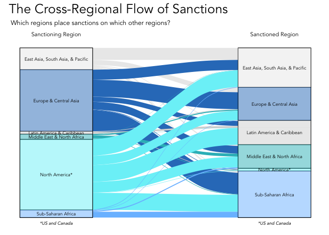

# Global Use of Sanctions

### Shray Dewan and Tristan Serr

# Our Research Questions:

How has the use of sanctions changed over time?

What is the distribution of countries that have sanctioned others and
countries that have been sanctioned?

What are the most frequent objectives and types of sanctions?

Because of the recent emphasis placed upon sanctions as a deterrent and
as a punishment for Russian aggression, we decided to take a look at the
historical use case of sanctions. In examining the above questions, our
goal was to discover which nations are using economic sanctions against
which other nations, of which kind of sanction, for which reasons, and
for how long. Answering these questions will hopefully allow us and
other viewers to make their own conclusions about whether or not
sanctions are a fair, effective, or productive use of economic will.

# Our Data:

Upon request via email, we received our dataset, titled sanctions.csv,
from a team of political scientists at the Global Sanctions Database, a
project of Drexel University. We came across this group from a New York
Times article analyzing the historical successes and failures of
sanctions, found
[here](https://www.nytimes.com/interactive/2022/03/11/world/economic-sanctions-history.html).
The GSDB’s website can be found
[here](https://www.globalsanctionsdatabase.com/).

Our CSV contains 1,102 observations from 14 variables, 13 of which we
used. We used variables that included the sanction target, the sanction
implementer, the start and end dates, dummy variables that described the
type of sanction, and a categorical variable involving objectives. The
only variable we chose to omit from our use case was the “success”
variable, which gave from the opinion of the Drexel researchers, the
supposed outcome of said sanction. This variable is very subjective,
both from the views of different researchers but also that of different
countries; thus, we saw it unfit to graphically portray.

# Our Plan, Workflow, and Designs:

For the first research question involving how the tool of sanctions
changed over time, we chose to make four graphs: two time series graphs,
one each for sanctioning states and sanctioned states overtime; and two
timelines, one for Middle Eastern countries who received sanctions from
the U.S., and one for Latin American countries that received sanctions
from the U.S.

For the second research question involving the distribution of sanctions
across the globe, we chose to implement three choropleths: two
univariate and one bivariate. Each univariate choropleth visualizes the
number of sanctions each nation has distributed and received,
respectively. The bivariate choropleth, represents the crossover between
these two metrics, as to visualize which countries distributed or
received more sanctions to or from the rest of the world.

``` r
library(tidyverse)
```

    ## ── Attaching core tidyverse packages ──────────────────────── tidyverse 2.0.0 ──
    ## ✔ dplyr     1.1.3     ✔ readr     2.1.4
    ## ✔ forcats   1.0.0     ✔ stringr   1.5.0
    ## ✔ ggplot2   3.4.3     ✔ tibble    3.2.1
    ## ✔ lubridate 1.9.2     ✔ tidyr     1.3.0
    ## ✔ purrr     1.0.2     
    ## ── Conflicts ────────────────────────────────────────── tidyverse_conflicts() ──
    ## ✖ dplyr::filter() masks stats::filter()
    ## ✖ dplyr::lag()    masks stats::lag()
    ## ℹ Use the conflicted package (<http://conflicted.r-lib.org/>) to force all conflicts to become errors

``` r
library(ggplot2)
library(cowplot)
```

    ## 
    ## Attaching package: 'cowplot'
    ## 
    ## The following object is masked from 'package:lubridate':
    ## 
    ##     stamp

``` r
library(ggpubr)
```

    ## 
    ## Attaching package: 'ggpubr'
    ## 
    ## The following object is masked from 'package:cowplot':
    ## 
    ##     get_legend

``` r
library(maps)
```

    ## 
    ## Attaching package: 'maps'
    ## 
    ## The following object is masked from 'package:purrr':
    ## 
    ##     map

``` r
library(gapminder)
library(biscale)
library(sf)
```

    ## Linking to GEOS 3.11.0, GDAL 3.5.3, PROJ 9.1.0; sf_use_s2() is TRUE

``` r
library(ggalluvial)
library(wesanderson)
library(magrittr)
```

    ## 
    ## Attaching package: 'magrittr'
    ## 
    ## The following object is masked from 'package:purrr':
    ## 
    ##     set_names
    ## 
    ## The following object is masked from 'package:tidyr':
    ## 
    ##     extract

``` r
library(dplyr)
library("data.table")
```

    ## 
    ## Attaching package: 'data.table'
    ## 
    ## The following objects are masked from 'package:lubridate':
    ## 
    ##     hour, isoweek, mday, minute, month, quarter, second, wday, week,
    ##     yday, year
    ## 
    ## The following objects are masked from 'package:dplyr':
    ## 
    ##     between, first, last
    ## 
    ## The following object is masked from 'package:purrr':
    ## 
    ##     transpose

``` r
library(vcd)
```

    ## Loading required package: grid

``` r
sanctions <- read_csv("sanctions.csv")
```

    ## Rows: 1101 Columns: 15
    ## ── Column specification ────────────────────────────────────────────────────────
    ## Delimiter: ","
    ## chr  (5): sanctioned_state, sanctioning_state, descr_trade, objective, success
    ## dbl (10): case_id, begin, end, length, trade, arms, military, financial, tra...
    ## 
    ## ℹ Use `spec()` to retrieve the full column specification for this data.
    ## ℹ Specify the column types or set `show_col_types = FALSE` to quiet this message.

``` r
world_map <- map_data("world")
regions <- read_csv("gapMinderGeo.csv")
```

    ## Rows: 197 Columns: 12
    ## ── Column specification ────────────────────────────────────────────────────────
    ## Delimiter: ","
    ## chr (9): geo, name, four_regions, eight_regions, six_regions, members_oecd_g...
    ## dbl (2): Latitude, Longitude
    ## lgl (1): World bank, 3 income groups 2017
    ## 
    ## ℹ Use `spec()` to retrieve the full column specification for this data.
    ## ℹ Specify the column types or set `show_col_types = FALSE` to quiet this message.

``` r
sanctioning_count <- data.frame(
  state = sort(unique(sanctions$sanctioning_state)))
sanctioning_count <- filter(sanctioning_count,str_detect(state,",",T))

sanctioned_count <- data.frame(
  state = sort(unique(sanctions$sanctioned_state)))
sanctioned_count <- filter(sanctioned_count,str_detect(state,",",T))

allstates <- rbind(sanctioned_count,sanctioning_count)
allstates <- sort(unique(allstates$state))
allstates <- data.frame(allstates)
names(allstates)[1]="region"

world_map_countries <- unique(select(world_map,region))
allstates <- rbind(allstates,world_map_countries)
allstates <- sort(unique(allstates$region))
allstates <- data.frame(allstates)
names(allstates)[1]="region"

allstates <- sort(unique(allstates$region))
allstates <- data.frame(allstates)
names(allstates)[1]="region"

allstates$sanctioning_count <- map_int(allstates$region,function(x){sum(str_count(sanctions$sanctioning_state,fixed(x)))})
allstates$sanctioned_count <- map_int(allstates$region,function(x){sum(str_count(sanctions$sanctioned_state,fixed(x)))})

allstates <- filter(allstates,sanctioning_count != 0 | sanctioned_count != 0)

world_map <- mutate(world_map,region=fct_recode(region,
                                                "Antigua and Barbuda"="Antigua",
                                                "Antigua and Barbuda"="Barbuda",
                                                "US"="USA"))
allstates <- subset(allstates,region!="Antigua")
allstates <- subset(allstates,region!="Barbuda")

allstates_names <- levels(as.factor(allstates$region))
map_names <- levels(as.factor(world_map$region))
map_names[which( !(map_names %in% allstates_names) )]
```

    ##  [1] "American Samoa"                      "Andorra"                            
    ##  [3] "Anguilla"                            "Antarctica"                         
    ##  [5] "Aruba"                               "Ascension Island"                   
    ##  [7] "Azores"                              "Bahamas"                            
    ##  [9] "Bangladesh"                          "Barbados"                           
    ## [11] "Bermuda"                             "Bhutan"                             
    ## [13] "Bonaire"                             "Botswana"                           
    ## [15] "Brunei"                              "Canary Islands"                     
    ## [17] "Cape Verde"                          "Cayman Islands"                     
    ## [19] "Chagos Archipelago"                  "Christmas Island"                   
    ## [21] "Cocos Islands"                       "Cook Islands"                       
    ## [23] "Curacao"                             "Falkland Islands"                   
    ## [25] "Faroe Islands"                       "French Guiana"                      
    ## [27] "French Polynesia"                    "French Southern and Antarctic Lands"
    ## [29] "Gabon"                               "Greenland"                          
    ## [31] "Grenadines"                          "Guadeloupe"                         
    ## [33] "Guam"                                "Guernsey"                           
    ## [35] "Guyana"                              "Heard Island"                       
    ## [37] "Isle of Man"                         "Jersey"                             
    ## [39] "Kosovo"                              "Madeira Islands"                    
    ## [41] "Marshall Islands"                    "Martinique"                         
    ## [43] "Mauritius"                           "Mayotte"                            
    ## [45] "Micronesia"                          "Monaco"                             
    ## [47] "Mongolia"                            "Montserrat"                         
    ## [49] "Morocco"                             "Namibia"                            
    ## [51] "Nevis"                               "New Caledonia"                      
    ## [53] "Niue"                                "Norfolk Island"                     
    ## [55] "Northern Mariana Islands"            "Oman"                               
    ## [57] "Palau"                               "Papua New Guinea"                   
    ## [59] "Pitcairn Islands"                    "Puerto Rico"                        
    ## [61] "Reunion"                             "Saba"                               
    ## [63] "Saint Barthelemy"                    "Saint Helena"                       
    ## [65] "Saint Kitts"                         "Saint Lucia"                        
    ## [67] "Saint Martin"                        "Saint Pierre and Miquelon"          
    ## [69] "Saint Vincent"                       "Samoa"                              
    ## [71] "San Marino"                          "Sao Tome and Principe"              
    ## [73] "Seychelles"                          "Siachen Glacier"                    
    ## [75] "Sint Eustatius"                      "Sint Maarten"                       
    ## [77] "Solomon Islands"                     "South Georgia"                      
    ## [79] "South Sandwich Islands"              "Swaziland"                          
    ## [81] "Timor-Leste"                         "Tobago"                             
    ## [83] "Tonga"                               "Trinidad"                           
    ## [85] "Turks and Caicos Islands"            "Vanuatu"                            
    ## [87] "Vatican"                             "Virgin Islands"                     
    ## [89] "Wallis and Futuna"                   "Western Sahara"

``` r
allstates_names[which( !(allstates_names %in% map_names) )]
```

    ##  [1] "African Union"                                 
    ##  [2] "Balkans"                                       
    ##  [3] "ChinCom"                                       
    ##  [4] "CoCom"                                         
    ##  [5] "Comecon"                                       
    ##  [6] "Commonwealth"                                  
    ##  [7] "CSCE"                                          
    ##  [8] "ECOWAS"                                        
    ##  [9] "EU"                                            
    ## [10] "FRY"                                           
    ## [11] "G8"                                            
    ## [12] "Hong Kong"                                     
    ## [13] "ICC Rome Statute Signatories"                  
    ## [14] "Kimberly Process Participants"                 
    ## [15] "League of Arab States"                         
    ## [16] "MERCOSUR"                                      
    ## [17] "NAFTA"                                         
    ## [18] "NATO"                                          
    ## [19] "OAPEC"                                         
    ## [20] "OIC"                                           
    ## [21] "Organisation of African Unity"                 
    ## [22] "Organization of American States"               
    ## [23] "Organization of Eastern Carribean States"      
    ## [24] "Pacific Islands Forum"                         
    ## [25] "Paris Agreement Signatories"                   
    ## [26] "SADC"                                          
    ## [27] "Terrorist Organizations (Al-Qaeda)"            
    ## [28] "Terrorist Organizations (ISIL and ANF)"        
    ## [29] "Terrorist Organizations (Taliban and Al-Qaeda)"
    ## [30] "Terrorist Organizations (Taliban)"             
    ## [31] "UN"                                            
    ## [32] "UNASUR"                                        
    ## [33] "Western countries"                             
    ## [34] "Yugoslavia"

To create the allstates dataset, which includes the counts of sanctions
placed and sanctions received for each region (country or organization
in the dataset, we first created and alphabetized the list of regions,
along with deleting any duplicates. Then, we used a string count
function to count the number of instances that the region appeared in
the sanctions placed or sanctions received column of the sanctions.csv.
Finally, we removed all regions that did not place or receive sanctions.

# Section 1: Sanctions Over Time

``` r
US_sanctions <- filter(sanctions, str_detect(sanctions$sanctioning_state,"US"))
eu_sanctions <- filter(sanctions, str_detect(sanctions$sanctioning_state,"EU"))
un_sanctions <- filter(sanctions, str_detect(sanctions$sanctioning_state,"UN"))
uk_sanctions <- filter(sanctions, str_detect(sanctions$sanctioning_state,"UK"))
ru_sanctions <- filter(sanctions, str_detect(sanctions$sanctioning_state,"Russia"))

num_sanc <- data.frame(year=1949:2019, 
                       number=rep(NA, length=71), 
                       USnumber=rep(NA, length=71),
                       eunumber=rep(NA, length=71),
                       unnumber=rep(NA, length=71),
                       uknumber=rep(NA, length=71),
                       runumber=rep(NA, length=71))

for(year in 1949:2019){
  num_sanc[num_sanc$year==year,"number"] <- nrow(filter(sanctions, begin<=year & end>=year))
  num_sanc[num_sanc$year==year,"USnumber"] <- nrow(filter(US_sanctions, begin<=year & end>=year))
  num_sanc[num_sanc$year==year,"eunumber"] <- nrow(filter(eu_sanctions, begin<=year & end>=year))
  num_sanc[num_sanc$year==year,"unnumber"] <- nrow(filter(un_sanctions, begin<=year & end>=year))
  num_sanc[num_sanc$year==year,"uknumber"] <- nrow(filter(uk_sanctions, begin<=year & end>=year))
  num_sanc[num_sanc$year==year,"runumber"] <- nrow(filter(ru_sanctions, begin<=year & end>=year))
}

ggplot(num_sanc)+
  geom_line(aes(x=year,y=number,color="Total"),size=1.5)+
  geom_line(aes(x=year, y=USnumber,color="US"),size=1.5)+
  geom_line(aes(x=year, y=eunumber,color="EU"),size=1.5)+
  geom_line(aes(x=year, y=unnumber,color="UN"),size=1.5)+
  geom_line(aes(x=year, y=uknumber,color="UK"),size=1.5)+
  geom_line(aes(x=year, y=runumber,color="Russia"),size=1.5)+
  theme_minimal()+
  scale_color_manual(values=c("Total"="dodgerblue2","US"="firebrick1","EU"="darkorchid","UN"="goldenrod1","UK"="chartreuse3","Russia"="darkorange1"))+
  labs(title="Number of Active Sanctions Placed by Countries Over Time",color="Regions",x="Year",y="Number of Sanctions") 
```

    ## Warning: Using `size` aesthetic for lines was deprecated in ggplot2 3.4.0.
    ## ℹ Please use `linewidth` instead.
    ## This warning is displayed once every 8 hours.
    ## Call `lifecycle::last_lifecycle_warnings()` to see where this warning was
    ## generated.

<!-- -->

Creating the time series plots proved to be an initial challenge, as our
dataset has a start and end date for each observation, rather than
making each observation a year variable. To get past this hiccup, it was
necessary to create a new data frame with a for(){} loop that would
count the number of rows in our main dataset that included a given year
within its start-end boundaries. Countries were then singled out by
filtering the initial dataset with a str_detect() function. This was
then graphically portrayed using geom_line() and geom_point() in ggplot.

Here we see the rampant increase in the use of economic sanctions in
1949, when our data commences, in the 1980s, and again at the turn of
the 21st century. Also note how far the top three nations/organizations,
all of them Western, are from Russia.

``` r
iran_sanced <- filter(sanctions, str_detect(sanctions$sanctioned_state,"Iran"))
russia_sanced <- filter(sanctions, str_detect(sanctions$sanctioned_state,"Russia"))
southafrica_sanced <- filter(sanctions, str_detect(sanctions$sanctioned_state,"South Africa"))
afghanistan_sanced <- filter(sanctions, str_detect(sanctions$sanctioned_state,"Afghanistan"))
china_sanced <- filter(sanctions, str_detect(sanctions$sanctioned_state,"China"))
vietnam_sanced <- filter(sanctions, str_detect(sanctions$sanctioned_state,"Vietnam"))
syria_sanced <- filter(sanctions, str_detect(sanctions$sanctioned_state,"Syria"))
libya_sanced <- filter(sanctions, str_detect(sanctions$sanctioned_state,"Libya"))

num_sanc_placed <- data.frame(year=1949:2019, 
                              number=rep(NA, length=71), 
                              irannumber=rep(NA, length=71), 
                              russianumber=rep(NA, length=71),
                              southafricanumber=rep(NA, length=71),
                              afghanistannumber=rep(NA, length=71),
                              chinanumber=rep(NA, length=71),
                              vietnamnumber=rep(NA, length=71),
                              syrianumber=rep(NA, length=71),
                              libyanumber=rep(NA, length=71))

for(year in 1949:2019){
  num_sanc_placed[num_sanc_placed$year==year,"number"] <- nrow(filter(sanctions, begin<=year & end>=year))
  num_sanc_placed[num_sanc_placed$year==year,"irannumber"] <- nrow(filter(iran_sanced, begin<=year & end>=year))
  num_sanc_placed[num_sanc_placed$year==year,"russianumber"] <- nrow(filter(russia_sanced, begin<=year & end>=year))
  num_sanc_placed[num_sanc_placed$year==year,"southafricanumber"] <- nrow(filter(southafrica_sanced, begin<=year & end>=year))
  num_sanc_placed[num_sanc_placed$year==year,"afghanistannumber"] <- nrow(filter(afghanistan_sanced, begin<=year & end>=year))
  num_sanc_placed[num_sanc_placed$year==year,"chinanumber"] <- nrow(filter(china_sanced, begin<=year & end>=year))
  num_sanc_placed[num_sanc_placed$year==year,"vietnamnumber"] <- nrow(filter(vietnam_sanced, begin<=year & end>=year))
  num_sanc_placed[num_sanc_placed$year==year,"syrianumber"] <- nrow(filter(syria_sanced, begin<=year & end>=year))
  num_sanc_placed[num_sanc_placed$year==year,"libyanumber"] <- nrow(filter(libya_sanced, begin<=year & end>=year))
}

ggplot(num_sanc_placed)+
  geom_line(aes(x=year, y=irannumber,color="Iran"),size=1.5)+
  geom_line(aes(x=year, y=russianumber,color="Russia"),size=1.5)+
  geom_line(aes(x=year, y=southafricanumber,color="South Africa"),size=1.5)+
  geom_line(aes(x=year, y=afghanistannumber,color="Afghanistan"),size=1.5)+
  geom_line(aes(x=year, y=chinanumber,color="China"),size=1.5)+
  geom_line(aes(x=year, y=vietnamnumber,color="Vietnam"),size=1.5)+
  geom_line(aes(x=year, y=syrianumber,color="Syria"),size=1.5)+
  geom_line(aes(x=year, y=libyanumber,color="Libya"),size=1.5)+
  theme_minimal()+
  scale_color_manual(values=c("Iran"="gold4","Russia"="brown1","South Africa"="darkgreen","Afghanistan"="darkolivegreen","China"="darkorange4","Vietnam"="lavenderblush4","Syria"="hotpink3","Libya"="darkslateblue"))+
  labs(title="Number of Active Sanctions Placed Upon Countries Over Time",color="Countries",x="Year",y="Number of Sanctions")
```

<!-- -->

This graph is similar to the first time-series graph but shows the
number of sanctions placed upon a given nation. The “Total” sanction
line would’ve been the same line as the first graph, so we chose to
leave it out. Note the periods of high sanction count for South Africa
(green) during apartheid, China (brown) after the 1949 revolution, Iran
(gold) until the 2017 nuclear deal, and Libya (purple) until the death
of Muammar Gaddafi.

``` r
# US ME SANCTIONS
us_me_sanc <- filter(US_sanctions,str_detect(US_sanctions$sanctioned_state,c("Algeria|Bahrain|Egypt|Iran|Iraq|Israel|Jordan|Kuwait|Lebanon|Libya|Morocco|Oman|Qatar|Saudi Arabia|Syria|Tunisia|United Arab Emirates
                                                                             |Yemen|League of Arab States|OAPEC|Terrorist Organizations (Taliban)|Terrorist Organizations (Taliban and Al-Qaeda)
                                                                             |Terrorist Organizations (ISIL and ANF)|Terrorist Organizations (Al-Qaeda)|Afghanistan")))

us_me_sanc <- mutate(us_me_sanc, case_id=52:1)

ggplot(us_me_sanc)+
  geom_segment(aes(x=begin, y=case_id, xend=end, yend=case_id, color=sanctioned_state))+
  geom_point(aes(x=begin, y=case_id, color=sanctioned_state))+
  geom_point(aes(x=end, y=case_id, color=sanctioned_state))+
  scale_color_manual(values=c("darkolivegreen1","darkolivegreen3","darkgreen","forestgreen","mediumseagreen","palegreen2","turquoise","cadetblue1","skyblue1","cornflowerblue","blue","deepskyblue4","darkblue","darkslateblue","darkorchid4"))+
  scale_fill_manual(values=c("darkolivegreen1","darkolivegreen3","darkgreen","forestgreen","mediumseagreen","palegreen2","turquoise","cadetblue1","skyblue1","cornflowerblue","blue","deepskyblue4","darkblue","darkslateblue","darkorchid4"))+
  labs(title="US Sanctions on Middle Eastern Countries Over Time, 1949-2019", subtitle="Sorted via Targeted Nation", x="Year", y="Sanction ID", color="Country")+
  theme_minimal()
```

<!-- -->

Because our raw dataset included start and end times, we thought it
appropriate to craft a few timelines of specific observations. The
following two plots use a filtered data file called US_sanctions to
narrow down the sanctioning state as the United States. We filtered this
data again using filter(str_detect()) to narrow down the sanctioned
states to countries in the Middle East or Latin America. These data
frames were then visualized with geom_segment().

This graph shows a timeline of U.S. sanctions in place against certain
countries in the Middle East and North Africa. Note how many sanctions
were ongoing at the end of this dataset, in 2019. This graph does a
great job of visualizing the length of said sanctions and for how long a
targeted nation had to endure economic rupture.

``` r
us_la_sanc <- filter(US_sanctions, str_detect(US_sanctions$sanctioned_state, c("Argentina|Bolivia|Chile|Paraguay|Belize|Guatemala|Uruguay|Peru|Ecuador|Venezuela|Colombia|Panama|Honduras|Brazil|Mexico|Belize|Haiti|
Dominican Republic|Suriname|Nicaragua|Costa Rica|El Savador|Cuba|Jamaica")))
us_la_sanc <- mutate(us_la_sanc, case_id=81:1)

ggplot(us_la_sanc)+
  geom_segment(aes(x=begin, y=case_id, xend=end, yend=case_id, color=sanctioned_state))+
  geom_point(aes(x=begin, y=case_id, color=sanctioned_state))+
  geom_point(aes(x=end, y=case_id, color=sanctioned_state))+
  scale_color_manual(values=c("darkgoldenrod3","darkgoldenrod1","gold1","darkolivegreen1","darkolivegreen3","darkgreen","forestgreen","mediumseagreen","palegreen2","turquoise","cadetblue1","skyblue1","cornflowerblue","blue","deepskyblue4","darkblue","darkslateblue","darkorchid4","hotpink4","mediumvioletred","darkorchid1"))+
  scale_fill_manual(values=c("darkgoldenrod3","darkgoldenrod1","gold1","darkolivegreen1","darkolivegreen3","darkgreen","forestgreen","mediumseagreen","palegreen2","turquoise","cadetblue1","skyblue1","cornflowerblue","blue","deepskyblue4","darkblue","darkslateblue","darkorchid4","hotpink4","mediumvioletred","darkorchid1"))+
  labs(title="US Sanctions on Latin American Countries Over Time, 1949-2019", subtitle="Sorted via Targeted Nation", x="Year", y="Sanction ID", color="Country")+
  theme_minimal()
```

<!-- -->

This graph is nearly identical to the prior timeline but involves Latin
American countries instead. Note here the immense length of time that
the U.S. imposed sanctions on Cuba (most of which are still ongoing).
Also notable is the start date of many sanctions, which is during the
Reagan administration.

# Section 2: Global Distributions of Sanctions

``` r
sanctions_c <- full_join(world_map,allstates,by="region")
sanctions_c[is.na(sanctions_c)]=0
orgs <- data.frame(long=c(-10,-10,10,10,-10,
                          30,30,50,50,30,
                          10,10,30,30,10,
                          -30,-30,-10,-10,-30),
                   lat=c(-60,-50,-50,-60,-60,
                         -60,-50,-50,-60,-60,
                         -60,-50,-50,-60,-60,
                         -60,-50,-50,-60,-60),
                   group=c(1,1,1,1,1,2,2,2,2,2,3,3,3,3,3,4,4,4,4,4),
                   order=c(1,2,3,4,5,1,2,3,4,5,1,2,3,4,5,1,2,3,4,5),
                   region=c("EU","EU","EU","EU","EU",
                            "UN","UN","UN","UN","UN",
                            "League of Arab States","League of Arab States","League of Arab States","League of Arab States","League of Arab States",
                            "African Union","African Union","African Union","African Union","African Union"),
                   subregion=c(1,1,1,1,1,2,2,2,2,2,3,3,3,3,3,4,4,4,4,4),
                   sanctioning_count=c(137,137,137,137,137,
                                       82,82,82,82,82,
                                       17,17,17,17,17,
                                       13,13,13,13,13),
                   sanctioned_count=c(5,5,5,5,5,
                                      0,0,0,0,0,
                                      1,1,1,1,1,
                                      0,0,0,0,0)
)
sanctions_c <- rbind(sanctions_c,orgs)
sanctions_c <- filter(sanctions_c,long!=0 & lat!=0)
```

The first step of the set-up process for the three choropleths was to
join the map data with the dataset that includes the count of sanctions
placed and received. The second step was to add four organizations that
have placed a large number of sanctions (over ten) onto the choropleths.
The third step was to set up for the log scale by reassigning zero
values to 0.9, thereby preventing any extreme negative values on the
choropleth.

``` r
sanctions_c$sanctioning_count[sanctions_c$sanctioning_count==0] <- 0.9

sanctioning_plot <- ggplot(filter(sanctions_c,region!="EU",region!="African Union",region!="UN",region!="League of Arab States"),
                           aes(x=long,y=lat,group=group,fill=log10(sanctioning_count)))+ 
  geom_polygon(color="black")+
  geom_polygon(data=orgs,color="black")+
  geom_polygon(data=filter(sanctions_c,region=="Lesotho"),color="black")+
  annotate("text",x=0,y=-55,label="EU",color="white")+
  annotate("text",x=-20,y=-55,label="African\nUnion",size=3)+
  annotate("text",x=40,y=-55,label="UN",color="white")+
  annotate("text",x=20,y=-55,label="League of\nArab States",size=2.4)+
  coord_map(xlim=c(-180,180),ylim=c(-55,90))+
  theme_void()+
  labs(title="Number of Sanctions Placed by Country",
       fill="Sanctions")
sanctioning_plot + 
  scale_fill_distiller(palette = "Blues",direction=1,breaks=c(0, 1, 2), labels = c(0, 10, 100))
```

<!-- -->

Considering the log scale, this graph demonstrates the extremely high
number of sanctions that the United States, as well as its Western
counterpart countries and organizations, have placed. Another noteworthy
observation is that sub-Saharan Africa hardly places any sanctions,
likely attributable to the financial burden that sanctions impose on the
sanctioning country itself.

``` r
sanctioned_plot <- ggplot(filter(sanctions_c,region!="EU",region!="African Union",region!="UN",region!="League of Arab States"),
                           aes(x=long,y=lat,group=group,fill=sanctioned_count))+ 
  geom_polygon(color="black")+
  geom_polygon(data=orgs,color="black")+
  geom_polygon(data=filter(sanctions_c,region=="Lesotho"),color="black")+
  annotate("text",x=0,y=-55,label="EU")+
  annotate("text",x=-20,y=-55,label="African\nUnion",size=3)+
  annotate("text",x=40,y=-55,label="UN")+
  annotate("text",x=20,y=-55,label="League of\nArab States",size=2.4)+
  coord_map(xlim=c(-180,180),ylim=c(-55,90))+
  theme_void()+
  labs(title="Number of Sanctions Placed Against Country",
       fill="Sanctions")
sanctioned_plot +
  scale_fill_distiller(palette = "YlOrRd",direction=1)
```

<!-- -->

This graph shows the disproportionate number of sanctions that the
Global South and non-Western countries have received.

``` r
bidata <- bi_class(sanctions_c,
                   x = sanctioned_count, y = sanctioning_count, style = "quantile", dim = 3)
bimap <- ggplot() +
  geom_polygon(data=filter(bidata,region!="EU",region!="African Union",region!="UN",region!="League of Arab States"), mapping = aes(x=long, y=lat, group=group, fill = bi_class), color = "white", size = 0.1, show.legend = F) +
  geom_polygon(data=filter(bidata,region=="EU"|region=="African Union"|region=="UN"|region=="League of Arab States"),mapping = aes(x=long, y=lat, group=group, fill = bi_class), color = "white", size = 0.1, show.legend = F) +
  geom_polygon(data=filter(bidata,region=="Lesotho"), mapping = aes(x=long, y=lat, group=group, fill = bi_class), color = "white", size = 0.1, show.legend = F) +
  annotate("text",x=0,y=-55,label="EU",color="white")+
  annotate("text",x=-20,y=-55,label="African\nUnion",size=3,color="black")+
  annotate("text",x=40,y=-55,label="UN",color="black")+
  annotate("text",x=20,y=-55,label="League of\nArab States",size=2.4,color="black")+
  bi_scale_fill(pal = "DkViolet", dim = 3) +
  coord_map(xlim=c(-180,180),ylim=c(-55,90))+
  labs(title = "Sanctions Placed vs. Against",x="",y="") +
  bi_theme()
bilegend <- bi_legend(pal = "DkViolet",
                           dim = 3,
                           xlab = "Sanctions Against",
                           ylab = "Sanctions Placed",
                           size = 8)
bifinmap <- ggdraw() +
  draw_plot(bimap, 0, 0, 1, 1)+
  draw_plot(bilegend, 0.1, 0.1, 0.2, 0.2)
bifinmap
```

<!-- -->

This graph differentiates between countries and organizations that are
better classified as “sanction placers” or “sanction receivers.” It is
evident that countries and organizations in the Global North—as well as
U.S. allies such as Saudi Arabia, Brazil, and Malaysia—are “sanction
placers” and countries in the Global South are generally “sanction
receivers.”

``` r
sanctions_luv <- sanctions
names(sanctions_luv)[2] = "region"
names(regions)[2] = "region"

#sanctions_luv_names <- levels(as.factor(sanctions_luv$region))
#regions_names <- levels(as.factor(regions$region))
#regions_names[which( !(regions_names %in% sanctions_luv_names) )]
#sanctions_luv_names[which( !(sanctions_luv_names %in% regions_names) )]

regions <- mutate(regions,region=fct_recode(region,
                                            "Democratic Republic of the Congo"="Congo, Dem. Rep.",
                                            "Republic of Congo"="Congo, Rep.",
                                            "Ivory Coast"="Cote d'Ivoire",
                                            "Kyrgyzstan"="Kyrgyz Republic",
                                            "Laos"="Lao",
                                            "North Macedonia"="Macedonia, FYR",
                                            "UK"="United Kingdom",
                                            "US"="United States"))
sanctions_luv <- mutate(sanctions_luv,region=fct_recode(region,
                                            "Albania"="Albania, Montenegro, Liechtenstein, Iceland",
                                            "Albania"="Balkans",
                                            "Russia"="Comecon",
                                            "Nigeria"="ECOWAS",
                                            "El Salvador"="El Salvador, Honduras",
                                            "Estonia"="Estonia, Latvia, Lithuania",
                                            "Germany"="EU",
                                            "India"="India, Pakistan",
                                            "Egypt"="League of Arab States",
                                            "Pakistan"="Pakistan, India",
                                            "Poland"="Poland, Hungary, Czech Republic",
                                            "Syria"="Syria, Russia, Iran",
                                            "Thailand"="Thailand, Vietnam"))

sanctions_luv <- left_join(sanctions_luv,regions,by="region")
sanctions_luv <- drop_na(sanctions_luv,`World bank region`)
names(sanctions_luv)[3] = "region2"
names(regions)[2] = "region2"

#sanctions_luv_names2 <- levels(as.factor(sanctions_luv$region2))
#regions_names2 <- levels(as.factor(regions$region2))
#regions_names2[which( !(regions_names2 %in% sanctions_luv_names2) )]
#sanctions_luv_names2[which( !(sanctions_luv_names2 %in% regions_names2) )]

sanctions_luv <- mutate(sanctions_luv,region2=fct_recode(region2,
                                                        "Nigeria"="African Union",
                                                        "Australia"="Australia, New Zealand",
                                                        "Austria"="Austria, Finland, Sweden, Switzerland",
                                                        "Belgium"="Belgium, France, Germany, Italy, Luxembourg, Netherlands, Denmark, Ireland, UK, Greece, Spain, Austria, Finland, Sweden",
                                                        "Canada"="Canada, EU, Japan, Norway",
                                                        "Canada"="Canada, Germany",
                                                        "UK"="Commonwealth",
                                                        "US"="CSCE",
                                                        "Democratic Republic of the Congo"="Democratic Republic of the Congo, Eritrea, Ethiopia, Kenya, Rwanda, Tanzania, Uganda, Zambia",
                                                        "Denmark"="Denmark, Finland, Iceland, Norway, Sweden",
                                                        "Denmark"="Denmark, France, Germany, Portugal, Italy",
                                                        "Denmark"="Denmark, Germany",
                                                        "Denmark"="Denmark, Netherlands, Sweden, Germany",
                                                        "Denmark"="Denmark, Norway, Canada, Australia, Switzerland, Germany",
                                                        "Nigeria"="ECOWAS",
                                                        "Egypt"="Egypt, Syria",
                                                        "Germany"="EU",
                                                        "Germany"="EU, Bulgaria, Cyprus, Czech Republic, Estonia, Hungary, Iceland, Norway, Romania, Slovakia, Slovenia",
                                                        "Germany"="EU, Canada",
                                                        "Germany"="EU, Croatia, North Macedonia, Albania, Bosnia and Herzegovina, Serbia, Liechtenstein, Norway, Moldova, Georgia",
                                                        "Germany"="EU, Croatia, North Macedonia, Albania, Montenegro, Iceland, Bosnia and Herzegovina, Serbia, Liechtenstein, Norway, Moldova, Georgia",
                                                        "Germany"="EU, Croatia, North Macedonia, Montenegro, Bosnia and Herzegovina, Iceland, Albania, Serbia, Liechtenstein, Norway",
                                                        "Germany"="EU, Croatia, North Macedonia, Montenegro, Iceland, Albania, Bosnia and Herzegovina, Liechtenstein, Norway, Moldova, Armenia",
                                                        "Germany"="EU, Croatia, North Macedonia, Montenegro, Iceland, Albania, Bosnia and Herzegovina, Liechtenstein, Norway, Ukraine, Moldova",
                                                        "Germany"="EU, Croatia, North Macedonia, Montenegro, Iceland, Albania, Bosnia and Herzegovina, Serbia, Liechtenstein, Norway, Moldova, Armenia",
                                                        "Germany"="EU, Croatia, North Macedonia, Montenegro, Iceland, Albania, Bosnia and Herzegovina, Serbia, Liechtenstein, Norway, Moldova, Armenia, Georgia",
                                                        "Germany"="EU, Croatia, North Macedonia, Montenegro, Iceland, Albania, Serbia, Liechtenstein, Norway, Moldova",
                                                        "Germany"="EU, Croatia, North Macedonia, Montenegro, Iceland, Liechtenstein, Norway, Moldova",
                                                        "Germany"="EU, Croatia, North Macedonia, Montenegro, Iceland, Serbia, Albania, Bosnia and Herzegovina, Liechtenstein, Norway, Moldova, Armenia",
                                                        "Germany"="EU, Cyprus, Czech Republic, Estonia, Hungary, Latvia, Lithuania, Malta, Poland, Slovakia, Slovenia, Bulgaria, Romania, Turkey, Iceland, Liechtenstein, Norway",
                                                        "Germany"="EU, Cyprus, Malta, Turkey, Croatia, North Macedonia, Montenegro, Iceland, Albania, Serbia, Bosnia and Herzegovina, Liechtenstein, Norway, Ukraine, Moldova, Armenia, Georgia, Switzerland",
                                                        "Germany"="EU, Montenegro, Iceland, Albania, Liechtenstein, Norway, Moldova",
                                                        "Germany"="EU, Montenegro, Iceland, Albania, Liechtenstein, Norway, Ukraine",
                                                        "Germany"="EU, North Macedonia, Montenegro, Albania, Bosnia and Herzegovina, Iceland, Liechtenstein, Norway, Moldova, Georgia",
                                                        "Germany"="EU, Turkey, Croatia, North Macedonia, Montenegro, Albania, Bosnia and Herzegovina, Serbia, Liechtenstein, Norway, Armenia, Georgia, Azerbaijan",
                                                        "Germany"="EU, Turkey, Croatia, North Macedonia, Montenegro, Albania, Bosnia and Herzegovina, Serbia, Liechtenstein, Norway, Ukraine, Moldova, Armenia, Georgia, Iceland",
                                                        "Germany"="EU, Turkey, Croatia, North Macedonia, Montenegro, Iceland, Albania, Bosnia and Herzegovina, Liechtenstein, Norway, Ukraine, Moldova, Armenia, Georgia, Serbia",
                                                        "Germany"="EU, Turkey, Croatia, North Macedonia, Montenegro, Iceland, Albania, Bosnia and Herzegovina, Serbia, Liechtenstein, Norway, Ukraine, Moldova, Armenia",
                                                        "Germany"="EU, Turkey, Croatia, North Macedonia, Montenegro, Iceland, Albania, Bosnia and Herzegovina, Serbia, Liechtenstein, Norway, Ukraine, Moldova, Armenia, Georgia",
                                                        "Germany"="EU, Turkey, Croatia, North Macedonia, Montenegro, Iceland, Albania, Serbia, Liechtenstein, Norway, Armenia",
                                                        "Germany"="EU, Turkey, Montenegro, Albania, Liechtenstein, Armenia, Georgia, Iceland, Norway",
                                                        "Germany"="EU, US, Norway",
                                                        "France"="France, Germany, UK",
                                                        "Germany"="Germany, Denmark",
                                                        "Germany"="Germany, Netherlands, Sweden",
                                                        "Germany"="Germany, Spain",
                                                        "China"="Hong Kong",
                                                        "Italy"="Italy, Belgium",
                                                        "Egypt"="League of Arab States",
                                                        "Mauritania"="Mauritania, Djibouti, Comoros, Jordan, Libya, Yemen, Niger",
                                                        "Brazil"="MERCOSUR",
                                                        "US"="NAFTA",
                                                        "Netherlands"="Netherlands, Italy, France, Belgium",
                                                        "Norway"="Norway, Sweden",
                                                        "Nigeria"="Organisation of African Unity",
                                                        "US"="Organization of American States",
                                                        "Antigua and Barbuda"="Organization of Eastern Carribean States",
                                                        "Australia"="Pacific Islands Forum",
                                                        "South Africa"="SADC",
                                                        "Saudi Arabia"="Saudi Arabia, Kuwait",
                                                        "Saudi Arabia"="Saudi Arabia, United Arab Emirates, Bahrain, Egypt",
                                                        "Spain"="Spain, UK",
                                                        "Sweden"="Sweden, Finland, Norway, Netherlands",
                                                        "UK"="UK, Denmark, Sweden, Norway, Netherlands, Japan",
                                                        "UK"="UK, France, Italy",
                                                        "UK"="UK, Norway, Ireland, Netherlands, Sweden",
                                                        "US"="US, EU",
                                                        "US"="US, France, Germany, Canada",
                                                        "US"="US, Italy, Sweden",
                                                        "US"="US, UK, France",
                                                        "US"="US, UK",
                                                        "Venezuela"="Venezuela, Colombia, Costa Rica, Dominican Republic"))

sanctions_luv <- full_join(sanctions_luv,regions,by="region2")
sanctions_luv <- drop_na(sanctions_luv,`World bank region.y`)
luv_data <- subset(sanctions_luv,select=c("World bank region.x","World bank region.y"))
names(luv_data)[1]="sanctioned_region"
names(luv_data)[2]="sanctioning_region"

luv_data2 <- mutate(luv_data,sanctioned_region=fct_recode(sanctioned_region,
                                                         "East Asia, South Asia, & Pacific"="East Asia & Pacific",
                                                         "East Asia, South Asia, & Pacific"="South Asia"))
luv_data2 <- mutate(luv_data2,sanctioning_region=fct_recode(sanctioning_region,
                                                          "East Asia, South Asia, & Pacific"="East Asia & Pacific",
                                                          "East Asia, South Asia, & Pacific"="South Asia"))
luv_data2 <- mutate(luv_data2,sanctioned_region=fct_recode(sanctioned_region,
                                                          "North America*"="North America"))
luv_data2 <- mutate(luv_data2,sanctioning_region=fct_recode(sanctioning_region,
                                                            "North America*"="North America"))

luv_data2 <- summarize(group_by(luv_data2,
                               sanctioned_region,sanctioning_region),freq=n())
```

    ## `summarise()` has grouped output by 'sanctioned_region'. You can override using
    ## the `.groups` argument.

``` r
luv_data2 <- drop_na(luv_data2,sanctioned_region)

ggplot(luv_data2,aes(y=freq,axis1=sanctioning_region,axis2=sanctioned_region))+
  geom_alluvium(aes(fill=sanctioning_region),alpha=1)+
  geom_stratum()+
  geom_text(stat="stratum",aes(label = after_stat(stratum)))+
  geom_bar(aes(x=1,fill=sanctioning_region,y=freq),stat="identity",width=1/3,alpha=.5)+
  geom_bar(aes(x=2,fill=sanctioned_region,y=freq),stat="identity",width=1/3,alpha=.5)+
  scale_fill_manual(values=c("East Asia, South Asia, & Pacific"="hotpink3",
                             "Europe & Central Asia" = "chartreuse4",
                             "Latin America & Caribbean" = "dodgerblue4",
                             "Middle East & North Africa"="coral3",
                             "Sub-Saharan Africa" = "darkgoldenrod2",
                             "North America*"="darkorchid4"))+
  scale_x_continuous(breaks=c(1,2),labels=c("Sanctioning Region","Sanctioned Region"))+
  theme_classic()+
  theme(axis.line = element_blank(),axis.ticks = element_blank(),axis.text.y = element_blank(),axis.title = element_blank())+
  labs(title="Sanctions from Region to Region",fill="Region")+
  annotate("text",x=1.5,y=-5.5,label="*US and Canada",size=2.4)
```

    ## Warning in to_lodes_form(data = data, axes = axis_ind, discern =
    ## params$discern): Some strata appear at multiple axes.

    ## Warning in to_lodes_form(data = data, axes = axis_ind, discern =
    ## params$discern): Some strata appear at multiple axes.

    ## Warning in to_lodes_form(data = data, axes = axis_ind, discern =
    ## params$discern): Some strata appear at multiple axes.

<!-- -->

The alluvial plot first shows which regions place a lot of sanctions
compared to which regions receive many sanctions. North America and
Europe & Central Asia place the vast majority of sanctions, but
Sub-Saharan Africa and East Asia, South Asia, & Pacific receive the
most. Moreover, Latin America & the Caribbean, the Middle East & North
Africa, and Sub-Saharan Africa place extremely few sanctions while North
America receives a minuscule number of sanctions. The graph also shows
which regions sanction which other regions. For instance, Sub-Saharan
Africa receives most of its sanctions from Europe & Central Asia while
Latin America & the Caribbean receive most of their sanctions from North
America.

# Section 3: Objectives & Types of Sanctions

``` r
obj <- data.frame(obj_name  = c("democracy", "destab_regime", "end_war", "human_rights", 
                                   "other", "policy_change", "prevent_war", "territorial_conflict", 
                                   "terrorism"))
obj_me <- data.frame(obj_name  = c("democracy", "destab_regime", "end_war", "human_rights", 
                                "other", "policy_change", "prevent_war", "territorial_conflict", 
                                "terrorism"),
                     region = c("Middle East & North Africa","Middle East & North Africa","Middle East & North Africa","Middle East & North Africa",
                                "Middle East & North Africa","Middle East & North Africa","Middle East & North Africa","Middle East & North Africa",
                                "Middle East & North Africa"))
obj_ssa <- data.frame(obj_name  = c("democracy", "destab_regime", "end_war", "human_rights", 
                                   "other", "policy_change", "prevent_war", "territorial_conflict", 
                                   "terrorism"),
                      region = c("Sub-Saharan Africa","Sub-Saharan Africa","Sub-Saharan Africa","Sub-Saharan Africa",
                                 "Sub-Saharan Africa","Sub-Saharan Africa","Sub-Saharan Africa","Sub-Saharan Africa",
                                 "Sub-Saharan Africa"))
obj_la <- data.frame(obj_name  = c("democracy", "destab_regime", "end_war", "human_rights", 
                                    "other", "policy_change", "prevent_war", "territorial_conflict", 
                                    "terrorism"),
                     region = c("Latin America & the Caribbean","Latin America & the Caribbean","Latin America & the Caribbean","Latin America & the Caribbean","Latin America & the Caribbean",
                                "Latin America & the Caribbean","Latin America & the Caribbean","Latin America & the Caribbean","Latin America & the Caribbean"))
obj_oth <- data.frame(obj_name  = c("democracy", "destab_regime", "end_war", "human_rights", 
                                   "other", "policy_change", "prevent_war", "territorial_conflict", 
                                   "terrorism"),
                     region = c("Other","Other","Other","Other","Other","Other","Other","Other","Other"))

me_sanc <- filter(sanctions,str_detect(sanctions$sanctioned_state,c("Algeria|Bahrain|Egypt|Iran|Iraq|Israel|Jordan|Kuwait|Lebanon|Libya|Morocco|Oman|Qatar|Saudi Arabia|Syria|Tunisia|United Arab Emirates
                                                                             |Yemen|League of Arab States|OAPEC|Terrorist Organizations (Taliban)|Terrorist Organizations (Taliban and Al-Qaeda)
                                                                             |Terrorist Organizations (ISIL and ANF)|Terrorist Organizations (Al-Qaeda)|Afghanistan")))

la_sanc <- filter(sanctions, str_detect(sanctions$sanctioned_state, c("Argentina|Bolivia|Chile|Paraguay|Belize|Guatemala|Uruguay|Peru|Ecuador|Venezuela|Colombia|Panama|Honduras|Brazil|Mexico|Belize|
                                                                      Haiti|Dominican Republic|Suriname|Nicaragua|Costa Rica|El Savador|Cuba|Jamaica")))

ssa_sanc <- filter(sanctions, str_detect(sanctions$sanctioned_state, c("Angola|Benin|Botswana|Burkina Faso|Burundi|Cabo Verde|Cameroon|Central African Republic|Chad|Comoros|Democratic Republic of the Congo|Republic of Congo|Ivory Coast|Djibouti|Equatorial Guinea|Eritrea|Ethiopia|Gabon|Gambia|Ghana|Guinea|Guinea-Bissau|Kenya|Lesotho|Liberia|Madagascar|Malawi|Mali|Mauritania|Mauritius|Mozambique|Namibia|Niger|Nigeria|Rwanda|Sao Tome and Principe|Senegal|Seychelles|Sierra Leone|Somalia|South Africa|South Sudan|Sudan|Swaziland|Tanzania|Togo|Uganda|Zambia|Zimbabwe")))


obj$count <- map_int(obj$obj_name,function(x){sum(str_count(sanctions$objective,fixed(x)))})
obj_me$count <- map_int(obj$obj_name,function(x){sum(str_count(me_sanc$objective,fixed(x)))})
obj_la$count <- map_int(obj$obj_name,function(x){sum(str_count(la_sanc$objective,fixed(x)))})
obj_ssa$count <- map_int(obj$obj_name,function(x){sum(str_count(ssa_sanc$objective,fixed(x)))})
obj_oth$count <- obj$count - obj_me$count - obj_la$count - obj_ssa$count
obj_comb <- rbind(obj_me,obj_la,obj_ssa,obj_oth)

obj_comb <- mutate(obj_comb,obj_name=fct_recode(obj_name,
                                            "Territorial Conflict"="territorial_conflict",
                                            "Destabilize Regime" = "destab_regime",
                                            "Terrorism" = "terrorism",
                                            "Other" = "other",
                                            "Prevent War"="prevent_war",
                                            "End War"="end_war",
                                            "Policy Change"="policy_change",
                                            "Democracy"="democracy",
                                            "Human Rights"="human_rights"))

ggplot(obj_comb,aes(x=reorder(obj_name,-count), y=count,fill=reorder(region,-count))) + 
  geom_bar(stat="identity",position="stack")+
  coord_flip()+
  labs(y="Frequency",x="Objectives",title = "Objectives of Sanctions by Selected Sanctioned Region",fill="Sanctioned Region")+
  theme_minimal()+
  scale_fill_manual(values=c("lightgrey","darkgoldenrod2","coral3","dodgerblue4"))
```

<!-- -->

This graph shows the objectives of sanctions by a few specific receiving
regions. Sub-Saharan Africa receives a disproportionate number of
sanctions for ending wars, democracy, and human rights reasons. The
Middle East & North Africa receive a large number of sanctions for
preventing war and terrorism reasons. Latin America & the Caribbean
receive many sanctions for destabilizing regimes, democracy, and human
rights reasons. The graph also shows that human rights and democracy are
the two most commonly-given reasons for sanctions.

``` r
num_sanc_type <- data.frame(country=c("US","EU","UN","UK","Japan","Russia","League of Arab States","African Union","Turkey","Albania","Montenegro","Venezuela"),
                            trade=rep(NA, length=12),
                            arms=rep(NA, length=12),
                            financial=rep(NA, length=12),
                            travel=rep(NA, length=12),
                            other=rep(NA, length=12))

for(country in c("US","EU","UN","UK","Japan","Russia","League of Arab States","African Union","Turkey","Albania","Montenegro","Venezuela")){
  num_sanc_type[num_sanc_type$country==country, "trade"] <- nrow(filter(sanctions, str_detect(sanctions$sanctioning_state, country),trade == "1"))
  num_sanc_type[num_sanc_type$country==country, "arms"] <- nrow(filter(sanctions, str_detect(sanctions$sanctioning_state, country),arms == "1"))
  num_sanc_type[num_sanc_type$country==country, "military"] <- nrow(filter(sanctions, str_detect(sanctions$sanctioning_state, country),military == "1"))
  num_sanc_type[num_sanc_type$country==country, "financial"] <- nrow(filter(sanctions, str_detect(sanctions$sanctioning_state, country),financial == "1"))
  num_sanc_type[num_sanc_type$country==country, "travel"] <- nrow(filter(sanctions, str_detect(sanctions$sanctioning_state, country),travel == "1"))
  num_sanc_type[num_sanc_type$country==country, "other"] <- nrow(filter(sanctions, str_detect(sanctions$sanctioning_state, country),other == "1"))
}

num_sanc_type <- select(num_sanc_type, c(1,3,4,7,6,2,5))
num_sanc_type <- mutate(num_sanc_type, arms1=arms)

country_means <- apply(num_sanc_type[,-1],FUN = mean,MARGIN=1)
country_sds <- apply(num_sanc_type[,-1],FUN = sd,MARGIN=1)
country_sum <- cbind(num_sanc_type[,1],country_means,country_sds)
country_sum <- as.data.frame(country_sum)

names(country_sum)[1] <- "country"
num_sanc_type <- left_join(num_sanc_type, country_sum, by="country")

num_sanc_type$country_means <- as.numeric(num_sanc_type$country_means)
num_sanc_type$country_sds <- as.numeric(num_sanc_type$country_sds)

num_sanc_type <- mutate(num_sanc_type, trade = (trade - country_means)/country_sds, arms = (arms - country_means)/country_sds, financial = (financial - country_means)/country_sds, travel = (travel - country_means)/country_sds, military=(military - country_means)/country_sds, other = (other - country_means)/country_sds, arms1 = (arms1 - country_means)/country_sds)

num_sanc_type <- select(num_sanc_type, -country_means, -country_sds)
names(num_sanc_type)[8] <- "arms"

num_sanc_type <- pivot_longer(num_sanc_type, names_to="key", values_to="values", c(2:7))

ggplot(num_sanc_type, aes(x=key, y=values, group=country))+
  geom_line()+
  geom_point(aes(color=key), size=2)+
  scale_color_manual(values=c("coral1","khaki","cornflowerblue","aquamarine","lightpink","lightgreen", "coral1"), name="Sanction Type")+  
  scale_x_discrete(name="", breaks=1:6, labels=c("arms","financial","military","other","trade","travel"))+
  labs(title="Distribution of Type of Sanction Across Selected Countries", y="Z-Score Value")+
  coord_polar()+
  theme_minimal()+
  facet_wrap(~country, strip.position="bottom")+
  theme(axis.text.y=element_text(size=10))+
  theme(strip.text.x=element_text(size=10))
```

<!-- -->

To utilize our type of sanction dummy variables of Arms, Financial,
Military, Trade, Travel, and Other. Radar plots avoided a central
problem with these dummy variables: many sanction observations had
multiple ‘1’ values across the six types of sanctions. It would’ve been
deceptive to use these values as normal numbers, as their total
represents a number greater than our total amount of observations. For
our radar plots, we first created a data frame via a for loop that
counted the number of ’1’s generated per specified country per type of
sanction. To standardize these numbers, we calculated the means and
standard variables of the above numbers for each country to get a
nation’s own z-score. Then, we used pivot_longer() to transform our data
frame and used geom_line and geom_point, in conjunction with
coord_polar, to create our radar charts. We used the ggradar package for
a final attempt at perfection but found the functions and commands of
this package to be rather incohesive with other ggplot2 items (for
example, we could not get our radar plot to facet).

In this graph, one is able see which types of sanctions are most
prevalent for each of the 12 present countries/organizations. Note the
high relative frequency of financial (yellow) sanctions for Western
nations.

# Final Analysis:

From our dataset and subsequent visualizations, we concluded that
sanctions are the tool of the privileged, and said tool has been used to
transcend traditional, and domestically unpopular, methods of coercion
and subjugation by developed economies. Our time series plots show that
the use of sanctions increased during the postwar era, during the 1980s,
and again in the 21st century, demonstrating the use of sanctions as a
direct substitute for unpopular war (such as World War II or the War in
Afghanistan) and as an instrument for more interventionist
administration (such as the Reagan administration). Our choropleths
visualize the more developed, Western nations and organizations (such as
the United States, the European Union, the United Nations, Canada,
Norway, etc.) as greater users of sanctions while nations that are often
the target of said sanctions (such as Russia, Iran, Libya, Venezuela,
etc.) are unable to retaliate, perhaps due to their more limited
economies. We know that sanctions are an economically burdensome policy
toll for both countries involved, and a country must be able to
internally tolerate the disruption that a lack of trade or finances will
cause.
